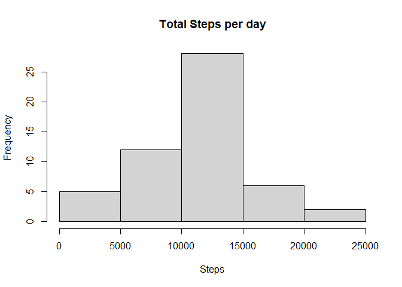
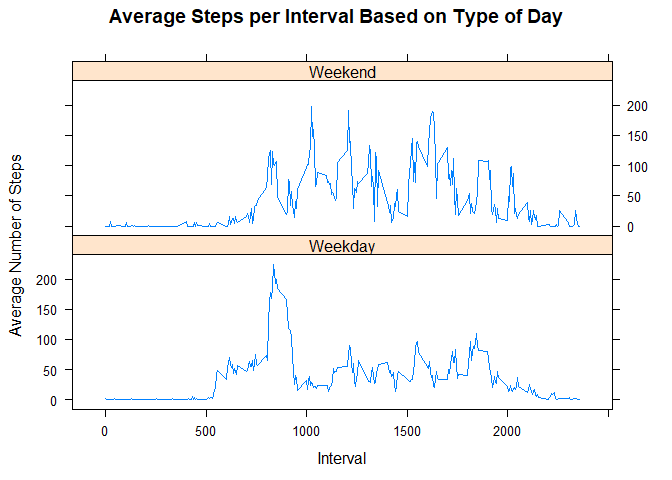

## Loading and preprocessing the data


```r
library(ggplot2)
library(plyr)

activity <- read.csv("activity.csv")

activity$day <- weekdays(as.Date(activity$date))
activity$DateTime <- as.POSIXct(activity$date, format="%Y-%m-%d")

clean <- activity[!is.na(activity$steps),]
```

## What is mean total number of steps taken per day?


```r
sumTable <- aggregate(activity$steps ~ activity$date, FUN=sum, )
colnames(sumTable) <- c("Date", "Steps")

hist(sumTable$Steps, breaks=5, xlab="Steps", main = "Total Steps per day")
```

<!-- -->

```r
as.integer(mean(sumTable$Steps))
```

```
## [1] 10766
```

```r
as.integer(median(sumTable$Steps))
```

```
## [1] 10765
```

The average number of steps taken each day was 10766 steps.
The median number of steps taken each day was 10765 steps.

## What is the average daily activity pattern?


```r
intervalTable <- ddply(clean, .(interval), summarize, Avg = mean(steps))
p <- ggplot(intervalTable, aes(x=interval, y=Avg), xlab="Interval", ylab="Average Number of Steps")
p + geom_line()+xlab("Interval")+ylab("Average Number of Steps")+ggtitle("Average Number of Steps per Interval")
```

<!-- -->

```r
maxSteps <- max(intervalTable$Avg)
intervalTable[intervalTable$Avg==maxSteps,1]
```

```
## [1] 835
```

The maximum number of steps for a 5-minute interval was 206 steps.
The 5-minute interval which had the maximum number of steps was the 835 interval.

## Imputing missing values


```r
nrow(activity[is.na(activity$steps),])
```

```
## [1] 2304
```

The total number of rows with steps = 'NA' is 2304.


```r
avgTable <- ddply(clean, .(interval, day), summarize, Avg=mean(steps))

nadata <- activity[is.na(activity$steps),]

newdata <- merge(nadata, avgTable, by=c("interval", "day"))

newdata2 <- newdata[,c(6,4,1,2,5)]
colnames(newdata2) <- c("steps", "date", "interval", "day", "DateTime")

mergeData <- rbind(clean, newdata2)

sumTable2 <- aggregate(mergeData$steps ~ mergeData$date, FUN=sum, )
colnames(sumTable2)<- c("Date", "Steps")

as.integer(mean(sumTable2$Steps))
```

```
## [1] 10821
```

```r
as.integer(median(sumTable2$Steps))
```

```
## [1] 11015
```

```r
hist(sumTable2$Steps, breaks=5, xlab="Steps", main = "Total Steps per Day with NAs Fixed", col="Black")
hist(sumTable$Steps, breaks=5, xlab="Steps", main = "Total Steps per Day with NAs Fixed", col="Grey", add=T)
legend("topright", c("Imputed Data", "Non-NA Data"), fill=c("black", "grey") )
```

<!-- -->

The new mean of the imputed data is 10821 steps, compared to the old mean of 10766 steps.
That creates a difference of 55 steps on average per day.

The new median of the imputed data is 11015 steps, compared to the old median of 10765 steps.
That creates a difference of 250 steps for the median.

However, the overall shape of the distribution has not changed.

## Are there differences in activity patterns between weekdays and weekends?


```r
mergeData$DayCategory <- ifelse(mergeData$day %in% c("sabado", "domingo"), "Weekend", "Weekday")
library(lattice)

intervalTable2 <- ddply(mergeData, .(interval, DayCategory), summarize, Avg = mean(steps))

xyplot(Avg~interval|DayCategory, data=intervalTable2, type="l",  layout = c(1,2),
       main="Average Steps per Interval Based on Type of Day", 
       ylab="Average Number of Steps", xlab="Interval")
```

<!-- -->

The step activity trends are different based on whether the day occurs on a weekend or not.
This may be due to people having an increased opportunity for activity beyond normal work hours
for those who work during the week.
